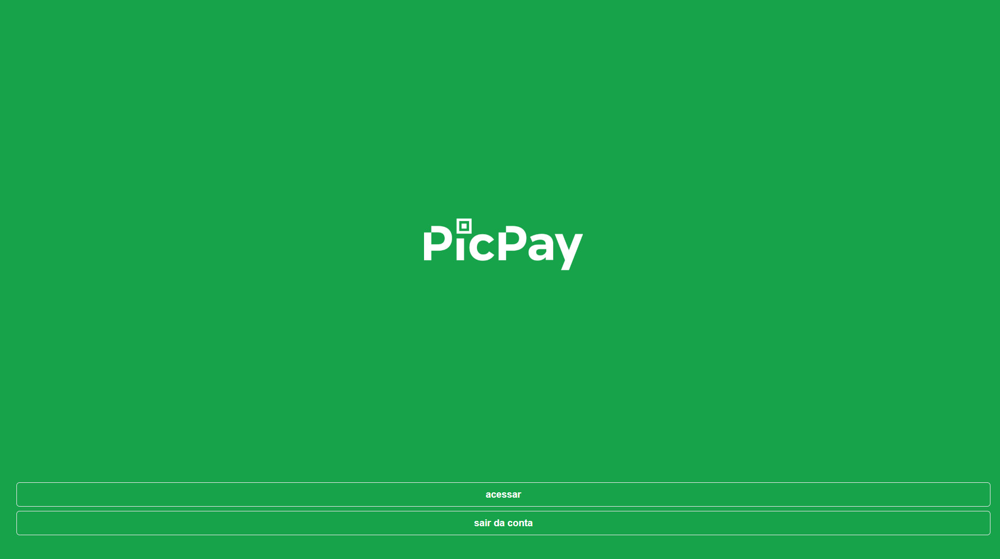
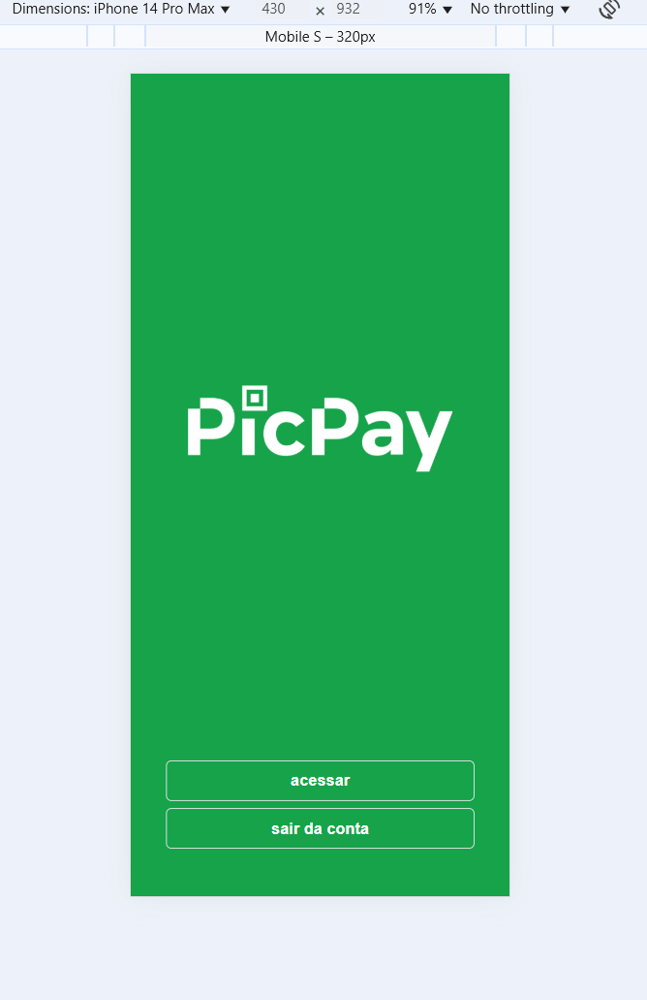

# 📱 Projeto Next.js – Tela Inicial Simples

Este é um projeto **Next.js** simples que representa uma **tela inicial/home** com foco em navegação básica, ideal para estudos, protótipos ou início de aplicações web.

---

## 🚀 Funcionalidades

* Layout centralizado e responsivo
* Navegação com **Next/Link**
* Botão para acesso à página de login
* Estrutura preparada para autenticação
* Estilização com **Tailwind CSS**

---

## 🖥️ Interface

A tela contém:

* Uma imagem central (logo ou ilustração)
* Botão **Acessar** que redireciona para `/login`
* Botão **Sair da conta** (ação futura)
* Layout em tela cheia com fundo verde

---

## 🧠 Tecnologias Utilizadas

* **Next.js (App Router)**
* **React**
* **Tailwind CSS**
* **JavaScript / TypeScript**

---

## ▶️ Como Executar o Projeto

```bash
npm install
npm run dev
```

Acesse no navegador:

```
http://localhost:3000
```

---

## 📂 Estrutura Básica

```
src/
 └── app/
     └── page.tsx   # Tela inicial
public/
 └── transferir.png # Imagem exibida na home
```



---

## 📌 Próximos Passos

* Criar página de login funcional
* Implementar autenticação
* Adicionar controle de sessão
* Melhorar acessibilidade

---

## 👨‍💻 Autor

**Emerson Sabino**
Desenvolvedor Full Stack


  
